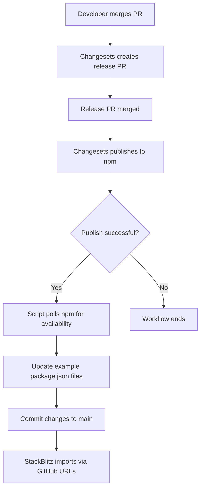

# StackBlitz Sync Implementation

This document describes the complete implementation of Step 2 of the StackBlitz sync issue.

## Overview

This implementation enables automatic synchronization of examples to StackBlitz after each npm release. Examples are kept up-to-date with the latest published packages, making them accessible via stable GitHub import URLs on StackBlitz.

## Architecture

### Components

1. **Sync Script** (`scripts/update-examples-npm-versions.sh`)

   - Polls npm registry for package availability
   - Updates example package.json files
   - Handles workspace references → npm versions

2. **GitHub Workflow** (`.github/workflows/release.yml`)

   - Detects successful npm publish
   - Executes sync script
   - Commits changes back to main branch

3. **Documentation**
   - `examples/STACKBLITZ.md` - All example URLs
   - `examples/README.md` - Integration guide
   - `docs/stackblitz-testing.md` - Testing procedures

### Workflow Sequence



## Technical Details

### Script Functionality

**Polling Mechanism:**

- Checks npm every 10 seconds
- Maximum 30 attempts (5 minutes total)
- Handles both @hey-api/openapi-ts and @hey-api/nuxt

**Update Logic:**

```bash
# Before (workspace reference)
"@hey-api/openapi-ts": "workspace:*"

# After (npm version)
"@hey-api/openapi-ts": "^0.55.0"
```

**Exclusions:**

- Skips `openapi-ts-sample` (not meant for StackBlitz)
- Preserves other workspace dependencies (e.g., @config/vite-base)

### StackBlitz Integration

**URL Format:**

```
https://stackblitz.com/github/{owner}/{repo}/tree/{ref}/{path}
```

**Our URLs:**

```
https://stackblitz.com/github/hey-api/openapi-ts/tree/main/examples/{example-name}
```

**Benefits:**

- ✅ Stable permalinks that never change
- ✅ Always pulls latest code from main branch
- ✅ No manual StackBlitz project updates needed
- ✅ Automatic dependency resolution from npm

## Available Examples

All examples (except openapi-ts-sample) are available:

1. Client Libraries:

   - openapi-ts-fetch
   - openapi-ts-axios
   - openapi-ts-ofetch

2. Frameworks:

   - openapi-ts-angular
   - openapi-ts-angular-common
   - openapi-ts-next
   - openapi-ts-nuxt

3. State Management:

   - openapi-ts-tanstack-react-query
   - openapi-ts-tanstack-vue-query
   - openapi-ts-tanstack-svelte-query
   - openapi-ts-tanstack-angular-query-experimental
   - openapi-ts-pinia-colada

4. Server-side:

   - openapi-ts-fastify

5. API-specific:
   - openapi-ts-openai

## Configuration

### Required GitHub Secrets

Already configured:

- `GIT_APP_CLIENT_ID` - GitHub App ID for authentication
- `GIT_APP_PRIVATE_KEY` - GitHub App private key
- `NPM_TOKEN` - npm publish token

No additional secrets needed for StackBlitz sync.

### Workflow Triggers

The sync runs automatically when:

1. Release PR is merged to main
2. Changesets successfully publishes packages
3. `steps.changesets.outputs.published == 'true'`

### Manual Execution

Script can be run manually:

```bash
# Run the sync script
pnpm examples:update-npm-versions

# Or directly
./scripts/update-examples-npm-versions.sh
```

## Testing

### Pre-release Testing

Test the script without waiting for npm:

```bash
# Create mock version
cat scripts/update-examples-npm-versions.sh | \
  sed 's/get_npm_version "@hey-api\/openapi-ts" 30/echo "0.55.0"/' > /tmp/test.sh

# Run test
bash /tmp/test.sh

# Verify changes
git diff examples/*/package.json

# Revert
git restore examples/*/package.json
```

### Post-release Verification

After each release:

1. Check workflow logs for sync step
2. Verify examples have npm versions (not workspace:\*)
3. Test StackBlitz URLs load correctly
4. Confirm dependencies install without errors

## Error Handling

### Common Scenarios

**Package not available on npm:**

- Script retries for 5 minutes
- Logs each attempt
- Fails gracefully if not found
- Check npm publish logs

**No changes to commit:**

- Script detects no workspace references
- Skips commit step
- Safe to run multiple times

**Git push fails:**

- Check GitHub permissions
- Verify workflow has write access
- Review git configuration

### Recovery Procedures

**Rollback examples:**

```bash
git checkout HEAD~1 -- examples/
git commit -m "Revert examples to previous state"
git push
```

**Re-run sync manually:**

```bash
pnpm examples:update-npm-versions
git add examples/*/package.json
git commit -m "Sync examples with npm versions"
git push
```

## Maintenance

### Adding New Examples

New examples are automatically included if:

1. Located in `examples/` directory
2. Has `package.json` with `@hey-api/openapi-ts` dependency
3. Uses `workspace:*` reference
4. Not named `openapi-ts-sample`

### Adding New Packages

To sync additional @hey-api packages:

1. Add to script's package list
2. Update polling logic if needed
3. Test with mock version

### Monitoring

Check these regularly:

- Workflow success/failure rate
- Time taken for npm availability
- StackBlitz URL functionality
- Example dependency health

## Future Enhancements

Potential improvements:

1. Sync to specific git tags for version permalinks
2. Update StackBlitz collection metadata programmatically
3. Create preview deploys for PR examples
4. Add StackBlitz config files to examples
5. Support for WebContainers-specific settings

## Comparison with Original Requirements

### Requirement 1: Build/Test Examples in CI ✅

- Already completed in previous PR
- Examples built and tested on every CI run
- Generated code checked for freshness

### Requirement 2: Sync to StackBlitz After Release ✅

- Implemented in this PR
- Examples updated after npm publish
- Stable permalink URLs maintained
- Automatic sync on every release

## Conclusion

This implementation provides a robust, automated solution for keeping StackBlitz examples synchronized with npm releases. The approach leverages StackBlitz's GitHub import feature to avoid the need for a StackBlitz API, while ensuring examples are always accessible and up-to-date.

**Key Achievements:**

- ✅ Automatic sync after every release
- ✅ No manual intervention required
- ✅ Stable, permanent URLs
- ✅ Comprehensive documentation
- ✅ Error handling and recovery procedures
- ✅ Testing guidelines

The solution is production-ready and will activate automatically on the next release.
